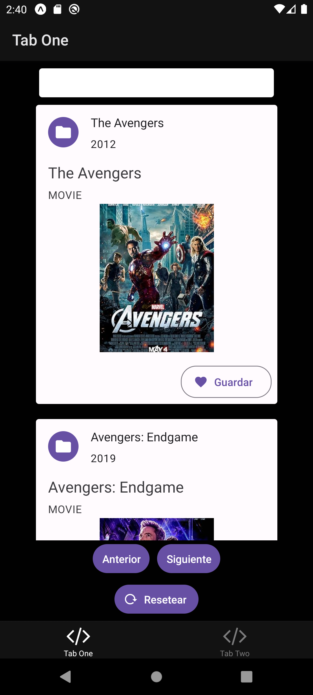

# Aplicacion de Películas

Este proyecto es una aplicación móvil desarrollada con React Native y Expo. Utiliza TypeScript para mejorar la tipificación y la calidad del código. Se trata de una app simple con un buscador de películas con la implementación del API [omdbapi](http://www.omdbapi.com) además de añadir la posibilidad de agregar a favoritos.

## Requisitos previos

Asegúrate de tener instalado Node.js y Expo CLI en tu máquina.

## Configuración

1. Clona este repositorio:

   ```bash
   git clone https://github.com/dbriceno10/pelis-react-native-app

Instala las dependencias:
cd mi-proyecto-expo-typescript
npm install

Inicia el servidor de desarrollo:
npm start

Escanea el código QR con la aplicación Expo Go en tu dispositivo móvil o ejecuta la aplicación en un emulador o mediandte el comando npm run android o npm run ios para dispositivos móviles, o bien npm run web para ejecutarlo en el navegador de tu computadora.


Estructura del proyecto
src/: Contiene los archivos fuente de la aplicación.
components/: Componentes reutilizables.
screens/: Pantallas de la aplicación.
navigation/: Configuración de navegación.
assets/: Recursos como imágenes y fuentes.
App.tsx: Punto de entrada de la aplicación.
tsconfig.json: Configuración de TypeScript.
Contribución
¡Siéntete libre de contribuir! Abre un issue o envía una pull request.

Licencia
Este proyecto está bajo la licencia MIT. Consulta el archivo LICENSE para más detalles.



<hr/>


---
⌨️ con ❤️ por [dbriceno10](https://github.com/dbriceno10) 😊